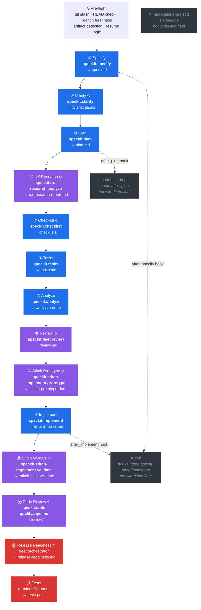

# Fleet Orchestrator Extension

Full-lifecycle feature orchestrator for [Spec Kit](https://github.com/danieldekay/spec-kit). Drives a feature from idea to merged code through 14 phases autonomously — auto-resumes, WIP auto-commits after every phase, auto-stashes dirty worktrees, and only interrupts via `vscode_askQuestions` for critical blockers or final ship approval.

Inspired by good ideas from the community: circuit breaker (Ralph), progress.md log (Ralph), machine-readable status tracker (Product Forge), sync-verify (Product Forge), change-request (Product Forge), post-implementation quality pipelines, and explicit --skip-* bypass flags (plan-review-gate).

## Phases

| # | Phase | Optional | Agent | Artifact |
|---|-------|----------|-------|----------|
| 1 | Specify | — | `speckit.specify` | `spec.md` |
| 2 | Clarify | `--skip-clarify` | `speckit.clarify` | `## Clarifications` in spec.md |
| 3 | Plan | — | `speckit.plan` | `plan.md` |
| 4 | UX Research | `--skip-ux` (auto-skip if no UI) | `speckit.ux-research.analyze` | `ux-research-report.md` |
| 5 | Checklist | `--skip-checklist` | `speckit.checklist` | `checklists/` |
| 6 | Tasks | — | `speckit.tasks` | `tasks.md` |
| 7 | Analyze | — | `speckit.analyze` | `.analyze-done` marker |
| 8 | Review | `--skip-review` | `speckit.fleet.review` | `review.md` (cross-model) |
| 9 | Stitch Prototype | `--skip-stitch` (auto-skip if no UI) | `speckit.stitch-implement.prototype` | `.stitch-prototype-done` |
| 10 | Implement | — | `speckit.implement` | all `[x]` in tasks.md |
| 11 | Stitch Validate | `--skip-stitch` (auto-skip if no UI) | `speckit.stitch-implement.validate` | `.stitch-validate-done` |
| 12 | Code Review | `--skip-code-review` | `speckit.code-quality.pipeline` | `reviews/quality-summary.md` + `.code-review-done` |
| 13 | Release Readiness | `--skip-release` | fleet orchestrator | `release-readiness.md` |
| 14 | Tests | — | terminal | CI passes |

**Key behaviors:**
- Resumes from the correct phase automatically — run `speckit.fleet.run` on any branch, at any point
- **Autonomous by default** — uses `vscode_askQuestions` only for critical blockers (FAIL/CRITICAL findings, circuit breaker, missing extensions) and final ship approval (Phase 13)
- **WIP auto-commits** after every artifact-producing phase (`wip(fleet): phase {N} {name}`), controlled by `git.auto_commit` config
- **Auto-stashes** uncommitted changes before the run (`git stash push -m "fleet-auto-stash: ..."`) and reminds at completion, controlled by `git.auto_stash` config
- **Auto-skips Phase 8** when `models.review` is `"ask"` (unconfigured) — no prompting on first run
- **CI auto-fix** — first iteration auto-fixes without asking; iteration 2+ uses `vscode_askQuestions`
- Parallel subagents (up to 3) during Plan and Implement for `[P]`-marked tasks
- **Circuit breaker**: 3 consecutive zero-progress implement batches → halt and ask
- **`progress.md` log**: timestamped entry after every completed phase or explicit skip/override decision, enables fast resume across sessions
- **`.fleet-status.yml` tracker**: machine-readable phase state, powers the sync command
- Context budget management with compact summaries between phases
- Phase 8 uses a *different model* than the rest of the workflow to catch blind spots
- Phase 12 Code Review runs the full `speckit.code-quality.pipeline` and writes canonical reports to `reviews/`
- Phase 13 Release Readiness generates a READY / CONDITIONAL / NOT READY checklist
- Phases 4, 9, and 11 auto-skip when the feature has no UI (keyword detection in spec.md/plan.md)

## Install

```bash
specify extension add fleet --from https://github.com/danieldekay/spec-kit-extensions/archive/refs/heads/main.zip
```

### VS Code Copilot users

After installing the extension, run this once to copy the agent files to `.github/agents/`:

```
/speckit.fleet.agents-install
```

Or copy manually:
```bash
mkdir -p .github/agents
cp .specify/extensions/fleet/agents/speckit.fleet.*.agent.md .github/agents/
```

## Commands

| Command | Alias | Description |
|---------|-------|-------------|
| `speckit.fleet.run` | `speckit.fleet.go` | Start or resume the full fleet workflow |
| `speckit.fleet.review` | — | Cross-model review of design artifacts (invoked by fleet automatically) |
| `speckit.fleet.agents-install` | — | Install VS Code Copilot agent files to `.github/agents/` |
| `speckit.fleet.sync` | — | Cross-cutting artifact drift detector (7 consistency layers) |
| `speckit.fleet.change-request` | — | Formal scope change with CR-NNN tracking and artifact markers |

## Configuration

After installing, generate a config file:

```bash
cp .specify/extensions/fleet/config-template.yml .specify/extensions/fleet/fleet-config.yml
```

For personal overrides (gitignored — never commit model choices):

```bash
touch .specify/extensions/fleet/fleet-config.local.yml
echo '.specify/extensions/fleet/fleet-config.local.yml' >> .gitignore
```

Config precedence (highest wins): CLI flags > env vars > fleet-config.local.yml > fleet-config.yml > extension defaults.

Key settings:

| Setting | Default | Description |
|---------|---------|-------------|
| `models.primary` | `"auto"` | Model for most phases |
| `models.review` | `"ask"` | Model for Phase 8 (cross-model review) — auto-skips when `"ask"`, set a model name to enable |
| `phases.skip_clarify` | `false` | Skip Phase 2 entirely |
| `phases.skip_ux` | `false` | Skip Phase 4 entirely (auto-skips if no UI detected) |
| `phases.skip_checklist` | `false` | Skip Phase 5 entirely |
| `phases.skip_review` | `false` | Skip Phase 8 entirely |
| `phases.skip_stitch` | `false` | Skip Phases 9+11 entirely (auto-skips if no UI detected) |
| `phases.skip_code_review` | `false` | Skip Phase 12 entirely |
| `phases.skip_release` | `false` | Skip Phase 13 entirely |
| `qa.cadence` | `"per_phase"` | When to run the Phase 12 code-quality pipeline: `per_phase` or `batch_end` |
| `qa.run_review` | `true` | Generate `reviews/code-review.md` |
| `qa.run_fix` | `true` | Apply auto-fixes and generate `reviews/code-fix-report.md` |
| `qa.run_validate` | `true` | Generate `reviews/validation-report.md` |
| `qa.run_future` | `true` | Generate `reviews/future-ideas.md` |
| `qa.pause_on_critical` | `true` | Pause Fleet if CRITICAL findings remain after Phase 12 |
| `git.auto_commit` | `true` | WIP auto-commit after every artifact-producing phase |
| `git.auto_stash` | `true` | Auto-stash uncommitted changes before fleet run |
| `parallelism.max_concurrent` | `3` | Max concurrent subagents |

## Requires

- `speckit >= 0.2.0`
- Core SpecKit commands: `speckit.specify`, `speckit.clarify`, `speckit.plan`, `speckit.checklist`, `speckit.tasks`, `speckit.analyze`, `speckit.implement`
- Recommended companion extensions for the full Fleet experience: `ux-research`, `stitch-implement`, `code-quality`

## Workflow Diagram — Core + Extensions

Fleet wraps the entire Spec Kit core flow and interleaves extension phases where they add the most value. Core commands run unconditionally (or with simple skip flags); extension phases degrade gracefully when the extension is not installed.



**Legend:** ◇ = optional / skippable &ensp;|&ensp; 🟦 core spec-kit &ensp;|&ensp; 🟪 extension &ensp;|&ensp; 🟥 fleet-only &ensp;|&ensp; ⬛ not integrated

### Coverage Analysis

| Source | Commands | In Fleet? |
|--------|----------|-----------|
| **Spec Kit core** (8) | `constitution`, `specify`, `clarify`, `plan`, `checklist`, `tasks`, `analyze`, `implement` | 7 of 8 — `constitution` is a one-time project init, not a per-feature phase |
| **ux-research** ext | `speckit.ux-research.analyze` | ✅ Phase 4 — auto-skips if no UI keywords in spec/plan |
| **stitch-implement** ext | `speckit.stitch-implement.prototype`, `.validate` | ✅ Phases 9 & 11 — auto-skip if no UI keywords |
| **code-quality** ext | `speckit.code-quality.pipeline` | ✅ Phase 12 — post-implementation quality gate |
| **fleet** (own) | `speckit.fleet.review`, release readiness, CI | ✅ Phases 8, 13, 14 |
| **codebase-impact** ext | `speckit.codebase-impact.analyze` | ❌ Not wired — `after_plan` hook exists but fleet skips it |
| **dod** ext | `speckit.dod.generate`, `.validate`, `.export`, `.report` | ❌ Not wired — `after_specify` and `after_implement` hooks exist but fleet skips them |
| **maqa-github-projects** ext | `speckit.maqa-github-projects.bootstrap`, `.populate` | ❌ Standalone — no hook overlap with fleet phases |

### Gaps

1. **`codebase-impact`** — natural fit between Phase 3 (Plan) and Phase 5 (Checklist). Fleet could invoke `speckit.codebase-impact.analyze` as Phase 3b, feeding IMPACT-NNN candidates into tasks.md.
2. **`dod`** — could generate `dod.yml` after Phase 1 (Specify) and validate criteria after Phase 10 (Implement), providing a machine-readable acceptance gate before code review.
3. **`maqa-github-projects`** — could sync task completion to GitHub Projects after Phase 6 (Tasks) and Phase 10 (Implement), though this is more of a side-effect than a pipeline phase.
