# Fleet Orchestrator Extension

All-in-one lifecycle orchestrator for [Spec Kit](https://github.com/danieldekay/spec-kit). Drives a feature from idea to merged code through 17 phases autonomously — with **bundled** Definition of Done, Codebase Impact, UX Research, Stitch prototyping, and Code Quality sub-commands. One `specify extension add fleet` brings the full pipeline.

Inspired by good ideas from the community: circuit breaker (Ralph), progress.md log (Ralph), machine-readable status tracker (Product Forge), sync-verify (Product Forge), change-request (Product Forge), post-implementation quality pipelines, adversarial multi-model code review (Anvil pattern), and explicit --skip-* bypass flags (plan-review-gate).

## Phases

| # | Phase | Optional | Command | Artifact |
|---|-------|----------|---------|----------|
| 1 | Specify | — | `speckit.specify` | `spec.md` |
| 2 | DoD Generate | `--skip-dod` | `speckit.fleet.dod-generate` | `dod.yml` |
| 3 | Clarify | `--skip-clarify` | `speckit.clarify` | `## Clarifications` in spec.md |
| 4 | Plan | — | `speckit.plan` | `plan.md` |
| 5 | Codebase Impact | `--skip-impact` | `speckit.fleet.codebase-impact-analyze` | `codebase-impact.md` |
| 6 | UX Research | `--skip-ux` (auto-skip if no UI) | `speckit.fleet.ux-research-analyze` | `ux-research-report.md` |
| 7 | Checklist | `--skip-checklist` | `speckit.checklist` | `checklists/` |
| 8 | Tasks | — | `speckit.tasks` | `tasks.md` |
| 9 | Analyze | — | `speckit.analyze` | `.analyze-done` marker |
| 10 | Review | `--skip-review` | `speckit.fleet.review` | `review.md` (cross-model) |
| 11 | Stitch Prototype | `--skip-stitch` (auto-skip if no UI) | `speckit.fleet.stitch-prototype` | `.stitch-prototype-done` |
| 12 | Implement | — | `speckit.implement` | all `[x]` in tasks.md |
| 13 | DoD Validate | `--skip-dod` | `speckit.fleet.dod-validate` | `.dod-validate-done` |
| 14 | Stitch Validate | `--skip-stitch` (auto-skip if no UI) | `speckit.fleet.stitch-validate` | `.stitch-validate-done` |
| 15 | Code Review | `--skip-code-review` | `speckit.fleet.quality-pipeline` + adversarial | `reviews/quality-summary.md` + `adversarial-review.md` |
| 16 | Release Readiness | `--skip-release` | fleet orchestrator | `release-readiness.md` |
| 17 | Tests | — | terminal | CI passes |

**Key behaviors:**
- Resumes from the correct phase automatically — run `speckit.fleet.run` on any branch, at any point
- **Autonomous by default** — uses `vscode_askQuestions` only for critical blockers (FAIL/CRITICAL findings, circuit breaker, missing extensions) and final ship approval (Phase 16)
- **WIP auto-commits** after every artifact-producing phase (`wip(fleet): phase {N} {name}`), controlled by `git.auto_commit` config
- **Auto-stashes** uncommitted changes before the run (`git stash push -m "fleet-auto-stash: ..."`) and reminds at completion, controlled by `git.auto_stash` config
- **Auto-skips Phase 10** when `models.review` is `"ask"` (unconfigured) — no prompting on first run
- **CI auto-fix** — first iteration auto-fixes without asking; iteration 2+ uses `vscode_askQuestions`
- Parallel subagents (up to 3) during Plan and Implement for `[P]`-marked tasks
- **Circuit breaker**: 3 consecutive zero-progress implement batches → halt and ask
- **`progress.md` log**: timestamped entry after every completed phase or explicit skip/override decision, enables fast resume across sessions
- **`.fleet-status.yml` tracker**: machine-readable phase state, powers the sync command
- Context budget management with compact summaries between phases
- Phase 2 DoD Generate produces machine-readable `dod.yml` from spec acceptance criteria; Phase 13 DoD Validate checks implementation against it
- Phase 5 Codebase Impact scans for integration points and produces IMPACT-NNN task candidates that feed into tasks.md
- Phase 10 uses a *different model* than the rest of the workflow to catch blind spots
- Phase 15 Code Review runs `speckit.fleet.quality-pipeline` then an **adversarial multi-model pass** — 2-3 review subagents on different AI models with consensus scoring
- Phase 16 Release Readiness generates a READY / CONDITIONAL / NOT READY checklist
- Phases 6, 11, and 14 auto-skip when the feature has no UI (keyword detection in spec.md/plan.md)

## Install

```bash
specify extension add fleet --from https://github.com/danieldekay/spec-kit-extensions/archive/refs/heads/main.zip
```

This single install brings all 20 commands — orchestration, DoD, codebase impact, UX research, Stitch prototyping, and code quality. No companion extensions required.

### VS Code Copilot users

After installing the extension, run this once to copy the agent files to `.github/agents/`:

```
/speckit.fleet.agents-install
```

Or copy manually:
```bash
mkdir -p .github/agents
cp .specify/extensions/fleet/agents/speckit.fleet.*.agent.md .github/agents/
```

## Commands

### Orchestration

| Command | Alias | Description |
|---------|-------|-------------|
| `speckit.fleet.run` | `speckit.fleet.go` | Start or resume the full fleet workflow |
| `speckit.fleet.review` | — | Cross-model review of design artifacts (invoked by fleet automatically) |
| `speckit.fleet.agents-install` | — | Install VS Code Copilot agent files to `.github/agents/` |
| `speckit.fleet.sync` | — | Cross-cutting artifact drift detector (7 consistency layers) |
| `speckit.fleet.change-request` | — | Formal scope change with CR-NNN tracking and artifact markers |

### Definition of Done (Phases 2 & 13)

| Command | Alias | Description |
|---------|-------|-------------|
| `speckit.fleet.dod-generate` | `speckit.fleet.dod-gen` | Parse spec.md and generate dod.yml with testable DoD criteria |
| `speckit.fleet.dod-validate` | `speckit.fleet.dod-check` | Validate implementation against dod.yml and update statuses |
| `speckit.fleet.dod-export` | `speckit.fleet.dod-sf` | Export dod.yml to specfact-compatible JSON for CI/CD |
| `speckit.fleet.dod-report` | `speckit.fleet.dod-rpt` | Generate human-readable DoD status report |

### Codebase Impact (Phase 5)

| Command | Alias | Description |
|---------|-------|-------------|
| `speckit.fleet.codebase-impact-analyze` | `speckit.fleet.impact` | Scan codebase for integration points and produce IMPACT-NNN candidates |

### UX Research (Phase 6)

| Command | Alias | Description |
|---------|-------|-------------|
| `speckit.fleet.ux-research-analyze` | `speckit.fleet.ux` | Analyze spec for UX needs and discover existing patterns |

### Stitch MCP (Phases 11 & 14)

| Command | Alias | Description |
|---------|-------|-------------|
| `speckit.fleet.stitch-prototype` | `speckit.fleet.stitch-ui` | Generate UI screens via Stitch MCP |
| `speckit.fleet.stitch-validate` | — | Validate implemented UI against Stitch prototypes |
| `speckit.fleet.stitch-setup` | — | Discover Stitch projects and design masters, write config override |

### Code Quality (Phase 15)

| Command | Alias | Description |
|---------|-------|-------------|
| `speckit.fleet.quality-pipeline` | `speckit.fleet.qa` | Full pipeline: review → fix → validate → future ideas → specfact sync |
| `speckit.fleet.code-review` | `speckit.fleet.cr` | Code review: refactoring, tech debt, dead code, smells |
| `speckit.fleet.code-fix` | `speckit.fleet.cf` | Auto-fix issues from the code review |
| `speckit.fleet.validate-requirements` | `speckit.fleet.vr` | Validate FR/NFR implementation, testability, and docs |
| `speckit.fleet.future-ideas` | `speckit.fleet.fi` | Generate ideas for improving and extending the feature |
| `speckit.fleet.specfact-sync` | `speckit.fleet.sf` | Export quality findings to specfact-compatible JSON |

## Configuration

After installing, generate a config file:

```bash
cp .specify/extensions/fleet/config-template.yml .specify/extensions/fleet/fleet-config.yml
```

For personal overrides (gitignored — never commit model choices):

```bash
touch .specify/extensions/fleet/fleet-config.local.yml
echo '.specify/extensions/fleet/fleet-config.local.yml' >> .gitignore
```

Config precedence (highest wins): CLI flags > env vars > fleet-config.local.yml > fleet-config.yml > extension defaults.

### Config sections

The config file has 6 namespaced sections. See `config-template.yml` for all options with comments.

| Section | Governs | Key settings |
|---------|---------|-------------|
| `fleet` | Orchestrator | `models.primary`, `models.review`, `phases.skip_*`, `qa.*`, `git.*`, `adversarial.*` |
| `dod` | Definition of Done | `criteria_per_fr`, `nfr_defaults`, `enforcement_level`, `specfact.*` |
| `codebase_impact` | Codebase Impact | `scan_depth`, `scan_directories`, `exclude_directories`, `risk_threshold` |
| `ux_research` | UX Research | `scan_depth`, `pattern_directories`, `tech_stack`, `component_registries` |
| `stitch` | Stitch MCP | `mode`, `variant_count`, `projects[]`, `design_masters[]` |
| `code_quality` | Code Quality | `review.*`, `fix.*`, `validate.*`, `future.*`, `specfact.*` |

### Key fleet settings

| Setting | Default | Description |
|---------|---------|-------------|
| `fleet.models.primary` | `"auto"` | Model for most phases |
| `fleet.models.review` | `"ask"` | Model for Phase 10 — auto-skips when `"ask"`, set a model name to enable |
| `fleet.phases.skip_*` | `false` | Skip individual phases |
| `fleet.qa.cadence` | `"per_phase"` | When to run quality pipeline: `per_phase` or `batch_end` |
| `fleet.qa.pause_on_critical` | `true` | Pause Fleet if CRITICAL findings remain |
| `fleet.adversarial.enabled` | `true` | Enable multi-model adversarial review in Phase 15 |
| `fleet.adversarial.models` | `["gpt-4.1", "gemini-2.5-pro", "claude-sonnet-4"]` | Models for adversarial review |
| `fleet.git.auto_commit` | `true` | WIP auto-commit after every artifact-producing phase |
| `fleet.git.auto_stash` | `true` | Auto-stash uncommitted changes before fleet run |

## Schemas

| File | Description |
|------|-------------|
| `schemas/dod.schema.json` | JSON Schema for `dod.yml` — validates DoD structure |
| `schemas/specfact-export.schema.json` | JSON Schema for specfact export format (format ID: `speckit-dod-export-v1`) |

## Requires

- `speckit >= 0.2.0`
- Core SpecKit commands: `speckit.specify`, `speckit.clarify`, `speckit.plan`, `speckit.checklist`, `speckit.tasks`, `speckit.analyze`, `speckit.implement`
- Optional: Stitch MCP server `>=1.0.0` for Phases 11/14

## Workflow Diagram

Fleet wraps the entire Spec Kit core flow and interleaves extension phases where they add the most value. Core commands run unconditionally (or with simple skip flags); bundled phases degrade gracefully when auto-skip conditions are met.

```mermaid
flowchart TD
    classDef core fill:#1f6feb,stroke:#1f6feb,color:#fff
    classDef bundled fill:#8957e5,stroke:#8957e5,color:#fff
    classDef fleet fill:#da3633,stroke:#da3633,color:#fff

    PRE["🔒 Pre-flight<br/>git stash · HEAD check · branch freshness<br/>artifact detection · resume logic"]

    P1["① Specify<br/><b>speckit.specify</b><br/>→ spec.md"]:::core
    P2["② DoD Generate ◇<br/><b>speckit.fleet.dod-generate</b><br/>→ dod.yml"]:::bundled
    P3["③ Clarify ◇<br/><b>speckit.clarify</b><br/>→ §Clarifications"]:::core
    P4["④ Plan<br/><b>speckit.plan</b><br/>→ plan.md"]:::core
    P5["⑤ Codebase Impact ◇<br/><b>speckit.fleet.codebase-impact-analyze</b><br/>→ codebase-impact.md"]:::bundled
    P6["⑥ UX Research ◇<br/><b>speckit.fleet.ux-research-analyze</b><br/>→ ux-research-report.md"]:::bundled
    P7["⑦ Checklist ◇<br/><b>speckit.checklist</b><br/>→ checklists/"]:::core
    P8["⑧ Tasks<br/><b>speckit.tasks</b><br/>→ tasks.md"]:::core
    P9["⑨ Analyze<br/><b>speckit.analyze</b><br/>→ .analyze-done"]:::core
    P10["⑩ Review ◇<br/><b>speckit.fleet.review</b><br/>→ review.md"]:::bundled
    P11["⑪ Stitch Prototype ◇<br/><b>speckit.fleet.stitch-prototype</b><br/>→ .stitch-prototype-done"]:::bundled
    P12["⑫ Implement<br/><b>speckit.implement</b><br/>→ all ☑ in tasks.md"]:::core
    P13["⑬ DoD Validate ◇<br/><b>speckit.fleet.dod-validate</b><br/>→ .dod-validate-done"]:::bundled
    P14["⑭ Stitch Validate ◇<br/><b>speckit.fleet.stitch-validate</b><br/>→ .stitch-validate-done"]:::bundled
    P15["⑮ Code Review ◇<br/><b>speckit.fleet.quality-pipeline</b><br/>+ adversarial multi-model<br/>→ reviews/ + adversarial-review.md"]:::bundled
    P16["⑯ Release Readiness ◇<br/>fleet orchestrator<br/>→ release-readiness.md"]:::fleet
    P17["⑰ Tests<br/>terminal CI runner<br/>→ tests pass"]:::fleet

    PRE --> P1
    P1 --> P2 --> P3 --> P4 --> P5 --> P6
    P6 --> P7 --> P8 --> P9 --> P10 --> P11
    P11 --> P12 --> P13 --> P14 --> P15
    P15 --> P16 --> P17
```



**Legend:** ◇ = optional / skippable &ensp;|&ensp; 🟦 core spec-kit &ensp;|&ensp; 🟪 bundled &ensp;|&ensp; 🟥 fleet-only

## Migration from v0.x (separate extensions)

If you previously had `fleet`, `dod`, `codebase-impact`, `ux-research`, `stitch-implement`, and `code-quality` installed as separate extensions:

1. Remove the old extensions: `specify extension remove dod codebase-impact ux-research stitch-implement code-quality`
2. Update fleet: `specify extension update fleet`
3. Update command references in any custom scripts: `speckit.dod.*` → `speckit.fleet.dod-*`, `speckit.codebase-impact.*` → `speckit.fleet.codebase-impact-*`, etc.
